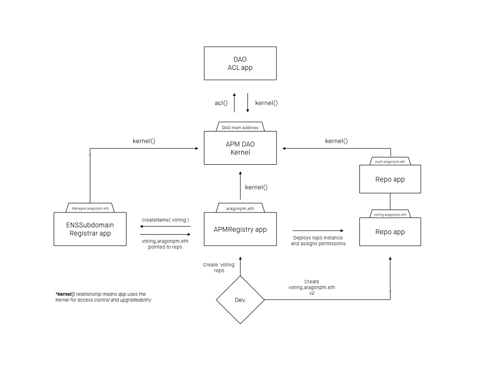

# aragonOS 3.0 alpha, developer documentation

*Documentation for [aragonOS](https://github.com/aragon/aragonOS) 3.0 reference implementation.
Updated March 26th, 2018. (aragonOS v3.1.2 release)*

This document provides a technical overview about the architecture and can be used
as a specification and developer guide. For a less technically-oriented introduction
to aragonOS 3.0, you can check the [alpha release blog post](https://blog.aragon.one/introducing-aragonos-3-0-alpha-the-new-operating-system-for-protocols-and-dapps-348f7ac92cff).

## 0. Motivation

aragonOS was born in our path to developing modular and upgradeable smart contracts
to power decentralized organizations.

As the project was maturing and we started abstracting more and more, we ended up
with a pretty generic framework that can be used by any protocol or decentralized
application that needs upgradeability.

**Upgradeability** is really important when developing high-stakes systems in
platforms that are still evolving fast. Done well, it can allow for bug fixes
and improvements with very little disruption and not causing problems at the
protocol level. As a history lesson, if *The DAO* had had an effective
upgradeability mechanism, no hard fork would have been required to fix the problem.
which cost the community months of unproductive discussions, delays in the roadmap
and billions lost in the market capitalization of the protocol due to loss of
network effect because of the fork.

But upgradeability is a double edged sword. It doesn't matter how secure or trustless
a smart contract is, if it can be upgraded, the contract will effectively be whatever
who/what can upgrade the contract decides. The guarantees of an upgradeable smart
contract are only as strong as the **governance mechanism** that can upgrade it,
making governance the most important aspect of upgradeability.

In a similar way, you cannot have effective governance without a way for upgrading
itself to a superior form of governance. Therefore we feel very strongly that
**upgradeability** and **governance**, in the context of smart contract, are actually
**two sides of the same coin**.

At Aragon we are doing research in decentralized governance and all the
results of our research will be made aragonOS compatible, meaning that by using
aragonOS, any protocol can take advantage of our extensive research on governance
for upgradeability or any other aspect of the protocol or application.

## 1. General architecture and design philosophy

Using aragonOS to build a system allows to **decouple** specific **business
logic** of a protocol or application, from its **authentication logic**.

It allows to code your application without thinking about authentication or
governance at all, just by inheriting from the **AragonApp** base class and defining
actions that require authentication with a special modifier, aragonOS can handle
authentication for the protocol.

### 1.1 Basic concepts: Proxy and Forwarder

Before describing general ideas about the architecture, it is important to
understand two concepts the entire framework builds upon:

- **Proxy:** A Proxy is a very simple smart contract construct which consists on
decoupling the instance of a particular smart contract with the location of its actual
business logic. We call individual instances of contracts **Proxy** and the logic
**base contracts**. A Proxy delegates all its logic on a base contract. Upgradeability
is achieved because this link to the base contract can be modified, effectively
updating the Proxy business logic. We created [ERC897](https://github.com/ethereum/EIPs/pull/897) to standardize Proxy interfaces
for better interoperability in the ecosystem.

- **Forwarder:** A Forwarder is a contract that, given some conditions, will pass
along a certain action to other contract(s).
Thanks to the fact that proxies allow a certain instance of a contract to never
have to change its address even if its underlying logic changes, this allows to
identify a concept such as that an action has been approved in a voting with a
certain support by a group of holders of a token, just by checking that the
action **sender address is an instance of a Voting app with a particular address**.
This helps with the decoupling of authentication and logic explained before.

### 1.2 Architecture: Kernel and apps

An organization or protocol that is built with aragonOS is composed by a set of smart contracts of two types:

- **Kernel:** it is at the core of every organization, there is only one instance of it per organization. It manages one very important mapping to keep track of the different *base contract* address depending on the application, registered apps in the kernel (such as the ACL) or the kernel’s own *base contract*.
- **Apps:** are contracts that rely on use the kernel for their upgradeability and access control. Apps don’t need to implement any of those as they occur directly in the Kernel or ACL.

### 1.3 Design philosophy

The design philosophy we use when developing Aragon apps is very similar to the UNIX philosophy, we try to architect them to do one thing and one thing well, and to respect and implement the few aragonOS interfaces so that they play nicely with the rest of the ecosystem.

This results in purely technical benefits such as testability, but it is also very powerful when apps are combined and the output of one app becomes the input of an other one (forwarders resemble UNIX pipes in some way).

### 1.4 Lifecycle of an aragonOS call


## 2. Kernel
### 2.1 The app mapping

At the core of the kernel lives a mapping, called the `app` mapping, which is very
critical.

Modifying this mapping can have completely destructive consequences and can result in loss of funds. The permission to execute this action has to be well protected behind the ACL.

```solidity
function setApp(bytes32 namespace, bytes appId, address app) public;
```

- **Namespace:** specifies what type of app record is being set.
- **AppId:** used to identify what app is being set. It is the [ENS `namehash`](http://docs.ens.domains/en/latest/introduction.html#namehash) of the APM repo (e.g. `namehash('voting.aragonpm.eth')`).
- **App:** Address of a contract that can have different meaning depending on the namespace.

### 2.2 Namespaces

- **Core namespace** (`keccak256('core')`): in this namespace is where the core components of the kernel reside. The only thing in the core mapping is the reference to the kernel base contract.
- **Base namespace** (`keccak256('base')`): keeps track of the base contracts for appIds.
- **App namespace** (`keccak256('app')`): some apps use the app namespace as a way to reference other apps. For example this is used to store the reference to the ACL instance or the EVMScriptsRegistry.

## 3. Upgradeability

Upgradeability of apps and the kernel is done by setting a new address for a
specific key in the `apps` mapping in the kernel.

### 3.1 Kernel upgradeability

Kernel instances for different organizations can share the same implementation.
Every Kernel instance is a KernelProxy . The logic for upgrading to a new implementation
is in the implementation itself. An upgrade to the Kernel could render it un-upgradeable.

Upgrading the kernel of an organization is done by changing the **Kernel appId**
in the **Core namespace**

```solidity
kernel.setApp(kernel.CORE_NAMESPACE(), kernel.KERNEL_APP_ID(), newKernelCodeAddr)
```

### 3.2 AppProxies and upgradeability

In a similar fashion to the Kernel, apps can share implementation code to save
gas on deployment. AppProxies rely their upgradeability to the Kernel.

Upgrading an app is done by setting a new app address for the **appId** for the
**Base namespace** in the kernel.

```solidity
kernel.setApp(kernel.APP_BASES_NAMESPACE(), votingAppId, newVotingAppCodeAddr)
```

aragonOS provides two different types of App Proxies:

- **UpgradeableAppProxy**: in every call to the proxy, it checks with the Kernel
what the current code for that appId is and forwards the call.

- **PinnedAppProxy**: on contract creation it checks and saves the app code currently
in the Kernel. This cannot be upgraded unless the app code has explicit logic to
change that storage slot.

There is an extra function in the Kernel that allows for setting the app code and at
the same time creating a new proxy. This function only sets the code the first time.

```solidity
kernel.newAppInstance(votingAppId, votingApp)
kernel.newPinnedAppInstance(votingAppId, votingApp)
```

### 3.3 App sandbox (client side)

It is of paramount importance that apps can not change the DOM of other apps in an attempt to mislead users. As such, all apps are sandboxed.

This means that apps are run inside an iframe that only has access to itself, and in order to send transactions, calls, and more, it communicates with the Aragon dapp (the "wrapper") through a custom RPC protocol built specifically for Aragon. Apps do not have direct access to Web3.

RPC calls are sent to the wrapper using the PostMessage API and the wrapper will use the information in the calls to perform specific actions, such as listen for events, cache values and calculate transaction paths.

In practice, this means that apps only publish intents, and do not execute actions directly. Instead, all business logic is deffered to the wrapper.

## 4. ACL

A **Permission** is defined as the ability to perform actions (grouped by roles) in a certain app instance (identified by its address).

We refer to a **Permission Instance** as an entity holding a certain permission.

### 4.1 The ACL as an Aragon app, the Interface
First of all, you need to define your base ACL instance for your kernel with:

```solidity
acl = ACL(kernel.acl())
```

Then you can execute the following actions:

#### Create Permission

```solidity
acl.createPermission(address entity, address app, bytes32 role, address manager)
```

`createPermission()` will fail if that permission has pre-existing permission instances.

This action is identical to [`grantPermission()`](#grant-permission) except it allows the creation of a new permission if it doesn’t exist yet.

A role in the ACL protects access to `createPermission()` as this important function could be used in malicious ways. When the Kernel is initialized, it also creates the permission that grants the initializing address the ability to create new permissions.

Note that creating permissions is made mandatory by the ACL: all actions requiring yet-to-be-created permissions are disallowed by default. Any permission checks on non-existent permissions are failed automatically.

#### Grant Permission

```solidity
acl.grantPermission(address entity, address app, bytes32 role)
```

Grants `role` in `app` for an `entity`. Only callable by the `manager` of a certain permission. This `entity` would then be allowed to call all actions that their `role` can perform on that particular `app` until the permission manager revokes their role with [`revokePermission()`](#revoke-permission).

The `grantPermission()` action doesn’t require protection with the ACL because an entity can only make changes to a permission if it is the permission's `manager`.

#### Revoke Permission

```solidity
acl.revokePermission(address entity, address app, bytes32 role)
```

Revokes `role` in `app` for an `entity`. Only callable by the `manager` of a certain permission.

The `revokePermission()` action doesn’t need to be protected by the ACL either, as an entity can only make changes if it is the `manager` for a given permission.

#### Adding Permissions

Apps have the choice of which actions to protect behind the ACL, as some actions may make sense to be completely public. Protecting an action behind the ACL is done in the smart contract by simply adding the authentication modifier [`auth()`](https://github.com/aragon/aragonOS/blob/4f4e89abaac6c70243c8288b27272003ecb63e1d/contracts/apps/AragonApp.sol#L10) or [`authP()`](https://github.com/aragon/aragonOS/blob/4f4e89abaac6c70243c8288b27272003ecb63e1d/contracts/apps/AragonApp.sol#L15)(passing the role required as a parameter) to the action. On executing the action, the `auth()`/`authP()` modifiers check with the Kernel whether the entity performing the call holds the required role or not.


### 4.2 Basic ACL
As an example, the following steps show a complete flow for user "Root" to create a new DAO with the basic permissions set so that a [Voting app](https://github.com/aragon/aragon-apps/tree/master/apps/voting) can manage the funds stored in a [Vault app](https://github.com/aragon/aragon-apps/tree/master/apps/vault):

1. Deploy the Kernel and the ACL
2. Executing `kernel.initialize(acl, rootAddress)` which in turns calls `acl.initialize(rootAddress)` creates the "permissions creator" permission under the hood:
`createPermission(rootAddress, aclAddress, CREATE_PERMISSIONS_ROLE, rootAddress)`
3. Deploy the Voting app
4. Grant the Voting app the ability to call `createPermission()`:
`grantPermission(votingAppAddress, aclAddress, CREATE_PERMISSIONS_ROLE)` (must be executed by `rootAddress`)
5. Deploy the Vault app, which has a action called `transferTokens()`
6. Create a new vote via the Voting app to create the `TRANSFER_TOKENS_ROLE` permission
`createPermission(votingAppAddress, vaultAppAddress, TRANSFER_TOKENS_ROLE, votingAppAddress)`
7. If the vote passes, the Voting app then has access to all actions in the Vault protected by `TRANSFER_TOKENS_ROLE`, which in this case is just `transferTokens()`
8. Fund transfers from the Vault can now be controlled via votes from the Voting app. Each time a user wishes to transfer funds, they can create a new vote via the Voting app to propose an execution of the Vault's `transferTokens()` action. If, and only if, the vote passes, will the `transferTokens()` action be executed.

Note that the Voting app is also able to revoke or regrant the `TRANSFER_TOKENS_ROLE` permission as it is that permission's manager on `vaultAppAddress`.


### 4.3 Permission managers
As we have seen, when a permission is created, a **Permission Manager** is set for that specific permission. The permission manager is able to grant or revoke permission instances for that permission.

The Permission Manager can be changed with:

```solidity
acl.setPermissionManager(address newManager, address app, bytes32 role)
```

Changes the permission manager to `newManager`. Only callable by the `manager` of a certain permission.

The new permission manager replaces the old permission manager, resulting in the old manager losing any management power over that permission.

[`createPermission()`](#create-permission) executes a special case of this action to set the initial manager for the newly created permission. From that point forward, the manager can only be changed with `setPermissionManager()`.

There's also a getter for the Permission Manager:

```solidity
acl.getPermissionManager(address app, bytes32 role)
```

### 4.4 Parameter interpretation
When a permission is granted to an entity by the permission manager, it can be
assigned an array of parameters that will be evaluated every time the ACL is checked
to see if the entity can perform the action.

Parameters allow to perform certain computations with the arguments of a role in
order to decide whether the action can be done or not. This moves the ACL for being
a purely binary access list, to a more sophisticated system that allows way more
granular control.

An ACL parameter is comprised of a data structure with 3 values:

- **Argument Value** (`uint240`): It is the value to compare against depending on
the argument. It is a regular Ethereum memory word, that looses it 2 most significant
bytes of precision. The reason for this was to allow parameters to be saved in just
one storage slot, saving significant gas.
Even though `uint240`s are used, it can be used to store any integer up to `2^30 - 1`,
addresses and bytes32 (in the case of comparing hashes, losing 2 bytes of precision
shouldn't be a dealbreaker if the hash algorithm is secure). The only problem is
when
- **Argument ID** (`uint8`): Determines how the comparison value is fetched. From
0 to 200 it refers to the argument index number passed to the role. After 200, there
are some *special Argument IDs*:
	- `BLOCK_NUMBER_PARAM_ID` (`id = 200`): Sets comparison value to the block number
	at the time of execution. This allows for setting up timelocks depending
	on blocks.
	- `TIMESTAMP_PARAM_ID` (`id = 201`): Sets comparison value to the timestamp of the
	current block at the time of execution. This allows for setting up timelocks
	on time.
	- `SENDER_PARAM_ID` (`id = 202`): Sets comparison value to the sender of the call.
	(Currently useless because of [this issue]())
	- `ORACLE_PARAM_ID` (`id = 203`): Checks with an oracle at the address in the
	*argument value* and returns whether it returned true or false (no comparison with arg).
	- `LOGIC_OP_PARAM_ID` (`id = 204`): Evaluates a logical operation and returns
	true or false depending on its result (no comparison with arg).
	- `PARAM_VALUE_PARAM_ID` (`id = 205`): Uses value as return. Commonly used with
	the `RET` operation, to just return a value. If the value in the param is greater
	than 0, it will evaluate to true, otherwise it will return false.
- **Operation type** (`uint8`): Determines what operation is made to compare the
value fetched using the argument ID or the argument value. For all comparisons,
both values are compared in the following order `args[param.id] <param.op> param.value`.
Therefore for a greater than operation, with a `param = {id: 0, op: Op.GT, value: 10}`,
it will interpret whether the argument 0 is greater than 10. The implemented
operation types are:
	- None (`Op.NONE`): Always evaluates to `false`, regardless of parameter or arguments.
	- Equals (`Op.EQ`): Evaluates to true if every byte matches between `args[param.id]` and
	`param.value`.
	- Not equals (`Op.NEQ`): Evaluates to true if any byte doesn't match.
	- Greater than (`Op.GT`): Evaluates to true if `args[param.id] > param.value`.
	- Less than (`Op.LT`): Evaluates to true if `args[param.id] < param.value`.
	- Greater than or equal (`Op.GTE`): Evaluates to true if `args[param.id] >= param.value`.
	- Less than or equal (`Op.LTE`): Evaluates to true if `args[param.id] <= param.value`.
	- Return (`Op.RET`): Evaluates to true if `args[param.id]` is greater than one.
	Used with `PARAM_VALUE_PARAM_ID`, it makes `args[param.id] = param.value`, so it
	returns the parameter associated value.

While also representing an operation, when the id is `LOGIC_OP_PARAM_ID`, only the
ops below are valid. These operations use the parameter's value to point to other
parameters index in the parameter array. These values are encoded as `uint32`
numbers, left-shifted 32 bits to the left each (example: for example, an op that
takes two inputs value would be `0x00....0000000200000001`, would be input 1, 1,
and input 2, 2, refering to params at index 1 and 2). Available logic ops:
	- Not (`Op.NOT`): Takes 1 parameter index and evaluates to the opposite of what
	the linked parameter evaluates to.
	- And (`Op.AND`): Takes 2 parameter indices and evaluates to true if both
	evaluate to true.
	- Or (`Op.OR`): Takes 2 parameter indices and evaluates to true if any of them
	evaluate to true.
	- Exclusive or (`Op.XOR`): Takes 2 parameter indices and evaluates to true if
	only one of the parameters evaluate to true.
	- If else (`Op.IF_ELSE`): Takes 3 parameters, evaluates the first parameter
	and if it evaluates to true, it evaluates to whatever the parameter second
	parameter evaluates to, otherwise it evaluates to whatever the third parameter
	does.

### 4.6 Parameter execution
When evaluating a rule, the ACL will always evaluate the result of the first parameter.
This first parameter can be an operation that links to other parameters and its
evaluation depends on those parameter evaluation.

Execution is recursive and the result evaluated is always the result of the eval
of the first parameter.

### 4.7 Parameter encoding
To encode some logic operations (AND, OR, IF-ELSE) which link to other parameters, the following helpers are provided, where the function arguments always refer to parameter indexes in the `Param` array they belong to:

#### If-Else (ternary) operation
```solidity
encodeIfElse(uint condition, uint success, uint failure)
```

#### Binary operations (And, Or)
```solidity
encodeOperator(uint param1, uint param2)
```

### 4.8 Examples of rules
The interpreter supports encoding complex rules in what would look almost like a programming language, for example let’s look at the following [test case](https://github.com/aragon/aragonOS/blob/63c4722b8629f78350586bcea7c0837ab5882a20/test/TestACLInterpreter.sol#L112-L126):

```solidity
    function testComplexCombination() {
        // if (oracle and block number > block number - 1) then arg 0 < 10 or oracle else false
        Param[] memory params = new Param[](7);
        params[0] = Param(LOGIC_OP_PARAM_ID, uint8(Op.IF_ELSE), encodeIfElse(1, 4, 6));
        params[1] = Param(LOGIC_OP_PARAM_ID, uint8(Op.AND), encodeOperator(2, 3));
        params[2] = Param(ORACLE_PARAM_ID, uint8(Op.EQ), uint240(new AcceptOracle()));
        params[3] = Param(BLOCK_NUMBER_PARAM_ID, uint8(Op.GT), uint240(block.number - 1));
        params[4] = Param(LOGIC_OP_PARAM_ID, uint8(Op.OR), encodeOperator(5, 2));
        params[5] = Param(0, uint8(Op.LT), uint240(10));
        params[6] = Param(PARAM_VALUE_PARAM_ID, uint8(Op.RET), 0);

        assertEval(params, arr(uint256(10)), true);

        params[4] = Param(LOGIC_OP_PARAM_ID, uint8(Op.AND), encodeOperator(5, 2));
        assertEval(params, arr(uint256(10)), false);
    }
```

When assigned to a permission, this rule will **evaluate to true** (and therefore allow the action) if an oracle accepts it and the block number is greater than the previous block number, and either the oracle allows it (again! testing redundancy too) or the first parameter of the rule is lower than 10. The possibilities for customizing organizations/DApps governance model are truly endless, without the need to write any actual Solidity.

### 4.9 Events
[`createPermission()`](#create-permission), [`grantPermission()`](#grant-permission), and [`revokePermission()`](#revoke-permission) all fire the same `SetPermission` event that Aragon clients are expected to cache and process into a locally stored version of the ACL:

```solidity
SetPermission(address indexed from, address indexed to, bytes32 indexed role, bool allowed)
```

[`setPermissionManager()`](#set-permission-manager) fires the following event:

```solidity
ChangePermissionManager(address indexed app, bytes32 indexed role, address indexed manager)
```


## 5. Forwarders and EVMScript

Forwarders are one of the most important concepts of aragonOS. Rather than hardcoding the notion of a vote into each separate app’s functionality and ACL, one can instead use a generic Voting App, which implements the forwarding interface, to pass actions forward to other apps after successful votes. If the Voting App is set up to only allow a token’s holders to vote, that means any actions/calls being passed from it must have been approved by the token’s holders.

### 5.1 Forwarding and transaction pathing

The forwarding interface also allows the Aragon client through aragon.js to calculate what we call ‘forwarding paths’. If you wish to perform an action and the client determines you don’t have direct permission to do it, it will think of alternative paths for execution. For example, you might directly go to the Vault App wishing to perform a token transfer, and the client directly prompts you to create a vote, as you have permission to create votes, that will perform the transfer if successful, as illustrated in the animation below.


(governance model and characters are fictional)

We have designed our own scripting format, known as EVM scripts, to encode complex actions into a representation that can be stored and later executed by another entity. aragonOS 3.0 allows you to have multiple script executors that can be housed in your organization

### 5.2 EVMScripts

Script executors are contracts that take a script and an input and return an output after execution. We have built three script executors for the initial release:

#### 5.2.1 Script executors and EVMScriptRegistry

EVMScriptExecutors must follow this interface:

```solidity

interface IEVMScriptExecutor {
    function execScript(bytes script, bytes input, address[] blacklist) external returns (bytes);
}
```

Because script executors get are called with a `delegatecall`, in order to prevent
self-destructs, `IEVMScriptExecutor.execScript(...)` MUST return
at least 32 bytes so in case an executor `selfdestruct`s it could be detected.

##### 5.2.1.1 CallsScript
A simple way to concatenate multiple calls. It cancels the operation if any of the calls fail.

- **Script body:** (See source code file for spec of the payload)
- **Input:** None
- **Output:** None.
- **Blacklist:** Entire script reverts if a call to one of the addresses in the blacklist is performed.


### 5.3 Making an app a Forwarder

Examples of forwarders can be found in the aragon-apps repo, both the Voting and the Token Manager are forwarders.

### 5.3.1 Warnings

EVMScripts can be too powerful. Providing forwarding functionality to an app

Some things to have in mind when developing an app

For example the Token Manager has the token address in its blacklist because otherwise any token holder that is allowed to forward through the Token Manager would effectively have control over the token in the same way the Token Manager has, which would allow to bypass it. By having it in the blacklist, the latter 2 script executors can’t be used, so it only works with CallsScripts that don’t make calls to the token address.

##  6. The Aragon Package Manager
###  6.1 APM as an Aragon DAO
The Aragon Package Manager (APM) is built on top of aragonOS and is integrated as a
part of aragonOS. It is a DAO running on the same Aragon (taking advantage of
upgradeability and access control), that‘s used to build Aragon DAOs!

This allows for many APM registries to exist with different governance models for
package publishing and releasing new versions. There is an official Aragon curated one,
aragonpm.eth, which has very strict restrictions of what gets published and
very high quality standards, that we use for publishing our core components.

Different APM registries in which everyone can publish their packages are expected to
be created by the community.

This diagram tries to illustrate the architecture of an APM Registry DAO:



### 6.2 APMRegistry
#### 6.2.1 ENSSubdomainRegistrar

Ownership of the ENS name that the `APMRegistry` operates has to be transferred to
the `ENSSubdomainRegistrar` app that is part of the DAO.

The `APMRegistry` needs to have permission on the `ENSSubdomainRegistrar` to create
new names, which is done every time a repo is created.

#### 6.2.2 APMRegistry governance

Each instance of an APMRegistry can have different governance. Governance of a
registry is enforced directly using the DAO's ACL.

By default a new repo will set the creator (or `dev` param) as the owner of the
repo and it is the only address that can create new versions in the repo. However,
as the permission manager, this account can grant permission to other entities to
create versions. These entities can be anything from another dev, to a multisig or
a full blown DAO.

### 6.3 Repos

After discovering an entity in the DAO by traversing the ACL that is an app (see
section 2.3 *The apps of a DAO*), we can fetch its `app.appId()` and use ENS to
resolve its Repo contract:

```solidity
repo = Repo(Resolver(ens.resolver(appId)).addr(appId))
```
or using ens.js:
```js
repo = Repo.at(await ens.addr(appId))
```

Every individual Repo is an Aragon app that uses the APM DAO for its ACL.
Depending on each APM registry governance, the process for creating new versions
in the Repo or transferring ownership may vary.

A Repo keeps versioned state over:

  - **Smart contract library code** (`contractAddress`): the app code is the address of
  the deployed version of the app. The Kernel determines which version of the app
  it uses by pointing to the app code address associated with that version.
  - **Package content** (`contentURI`): defined by a location ID of where the other
  components of the package (e.g. frontend) are hosted (IPFS, Swarm, etc.) and
  the content hash for fetching it. Inside this package an `arapp.json` file is
  expected to be found.

A Repo can be created that only versions one of the two. It is fine to use it that
way but all the rules below still apply.

By versioning both the app code address and the package content, we can add
additional expectations for the what semantic versioning of Repos mean:

  - **Patch**: Minor changes to the package contents (e.g. frontend). Update can
  be performed silently for users.
  - **Minor**: Major changes to the package contents, but still works with the
  current smart contract code. Users should be notified of the update.
  - **Major**: Any change to the smart contract app code with or without an
  accompanying frontend upgrade. User interaction is needed to upgrade.

#### 6.3.1 Version upgrade rules
Before creating a new version in a repo, an ACL check is performed to see whether
the entity has permission to create a new version.

After the ACL check, the Repo logic checks whether the version upgrade is allowed.
A version bump for a package is defined by the following rules:

- Only one member of the version is increased by 1. The version components to the
left of the raised member must stay the same and the components to the right must be 0.
  - Example: From `2.1.3` the only allowed bumps are to `3.0.0` (major version),
  `2.2.0` (minor version), and `2.1.4` (patch version).
- Changes to the app code address can only be done if the raise changes the major
version (upgrading it to `M.0.0` by the above rule).

The initial version of an app must be a valid bump from version `0.0.0`.

By having this check performed at the smart contract level, we can load the correct
version of the frontend just by looking at an instance of an app. This is done by
checking that the version of a smart contract is linked to a given app by getting
its `appId` and `appCode` (See section *6.3.2.3 By latest contract address*)

#### 6.3.2 Fetching Repo versions
Repos offer multiple ways to fetch versions. By checking logs for the following
event one can see all the versions ever created in a Repo:

```solidity
(Repo) NewVersion(uint256 versionId, uint16[3] semanticVersion);
```

All different methods for fetching versions return the following tuple:

```solidity
repoVersion = (uint16[3] semanticVersion, address contractAddress, bytes contentURI)
```

#### 6.3.2.1 By versionId
Every version can be fetched with its `versionId` (which starts in `1` and is
increments by `1` each version).

```solidity
repoVersion = repo.getByVersionId(versionId)
```

The total count of versions created in a Repo can be queried with:
```solidity
count = repo.getVersionsCount()
lastVersionId = count - 1
```

#### 6.3.2.2 By semantic version
Providing the exact semantic version.
```solidity
repoVersion = repo.getBySemanticVersion([major, minor, patch])
```

#### 6.3.2.3 By latest contract address
Fetching the latest version by contract address allows clients to get the latest
frontend package for an organization that may have not upgraded the smart contract
code to the latest version.
```solidity
repoVersion = repo.getLatestForContractAddress(contractCode)
```

#### 6.3.2.4 Latest version
Pretty self-describing.
```solidity
repoVersion = repo.getLatest()
```

## 7. Aragon app development guide

This is a small walk through on how to build a fully upgradeable registry app with pluggable governance.

### 7.1 Getting the tools

The first thing you will need is aragon-dev-cli. This is the primary development tool for creating and publishing apps on Aragon.

```
npm i -g @aragon/cli
```

You also need to install your favorite Solidity development tool, such as Truffle.

```
npm i -g truffle
```

### 7.2 Directory structure

Next we initialize a new app using the CLI.

```
aragon init registry.aragonpm.eth bare
```

This will create a folder named `registry` in the current directory from the `bare` boilerplate. The `bare` boilerplate only includes the essentials: a directory structure, the manifest files and two dependencies; `@aragon/os` and `@aragon/client`.

```js
- contracts/
- test/
- manifest.json
- arapp.json
```

The boilerplate provides a contracts directory for your Solidity source files, a test directory for your Truffle tests and two Aragon-specific files: `manifest.json` and `arapp.json`.

As a rule of thumb, `manifest.json` defines everything the user will see, such as the human-readable app name, a description and icons. `arapp.json` defines everything aragon.js will need for transaction pathing and more, such as the app name (a fully qualified ENS name such as `voting.aragonpm.eth`), the current version of your app, the path to the contract sources and an array of roles used in transaction pathing.

To see what these files look like, check out our voting app's manifest files [here](https://github.com/aragon/aragon-apps/blob/master/apps/voting/manifest.json) and [here](https://github.com/aragon/aragon-apps/blob/master/apps/voting/arapp.json).

### 7.3 Writing the contract

Our contract is a simple registry, so it has three operations: get, set and remove. Let's write it as a normal contract first, and plug in AragonOS afterwards to illustrate how simple it is.

```solidity
pragma solidity ^0.4.15;

/**
 * A generic registry app.
 *
 * The registry has three simple operations: `add`, `remove` and `get`.
 *
 * The registry itself is useless, but in combination with other apps to govern
 * the rules for who can add and remove entries in the registry, it becomes
 * a powerful building block (examples are token-curated registries and stake machines).
 */
contract RegistryApp {
    // The entries in the registry.
    mapping(bytes32 => bytes32) entries;

    // Fired when an entry is added to the registry.
    event EntryAdded(bytes32 id);
    // Fired when an entry is removed from the registry.
    event EntryRemoved(bytes32 id);

    /**
     * Add an entry to the registry.
     * @param _data The entry to add to the registry
     */
    function add(
        bytes32 _data
    ) public returns (bytes32 _id) {
        _id = keccak256(_data);
        entries[_id] = _data;

        EntryAdded(_id);
    }

    /**
     * Remove an entry from the registry.
     * @param _id The ID of the entry to remove
     */
    function remove(
        bytes32 _id
    ) public {
        delete entries[_id];
        EntryRemoved(_id);
    }

    /**
     * Get an entry from the registry.
     * @param _id The ID of the entry to get
     */
    function get(
        bytes32 _id
    ) public constant returns (bytes32) {
        return entries[_id];
    }
}
```

So, now we have a registry contract, but how do we make it upgradeable? You simply import the `AragonApp` interface and inherit it.

```solidity
// ...

import "@aragon/os/contracts/apps/AragonApp.sol";

// ...

contract RegistryApp is AragonApp {
  // ...
}
```

That's it! Your contract is now fully upgradeable. But wait, there's more! What about governance?

If we add a governance layer **without** specifying the exact governance mechanism (i.e. `onlyOwner`), we could make all sorts of interesting registries using this contract - token curated registries, registries governed by simple democracy, registries governed by liquid democracy... the possibilities are truly endless.

To plug in governance, we need to learn about the ACL.

### 7.4 Using the ACL

The ACL (access-control list) defines who can do what where and under which circumstances. `who` can be any address: an app, your dog, your fridge or you. This, combined with the concept of forwarders ([learn more](#)) makes it possible to make very complex governance structures out of small building blocks.

You can sort of think of forwarders and apps as UNIX commands. They're small, they do one thing well, and might be useful in isolation, but they become more powerful when you combine them using the pipe operator (`|`). In this analogy, apps are the commands, and forwarders are the pipes.

This might sound a bit complex, but it's very simple to use.

1. You define the roles your app has. This has to be a `keccak256` of the role identifier. For example, a role named `ADD_ENTRY_ROLE` should be defined as such: `bytes32 public constant ADD_ENTRY_ROLE = keccak256("ADD_ENTRY_ROLE");`
2. You use the Solidity `auth` or `authP` modifiers provided by `AragonApp`

Let's try this for our registry. We define two roles, `ADD_ENTRY_ROLE` and `REMOVE_ENTRY_ROLE`:

```solidity
// ...

contract RegistryApp is AragonApp {
  bytes32 public constant ADD_ENTRY_ROLE = keccak256("ADD_ENTRY_ROLE");
  bytes32 public constant REMOVE_ENTRY_ROLE = keccak256("REMOVE_ENTRY_ROLE");
  // ...
}
```

Next, we guard the `add` and `remove` functions with the `auth` modifier:

```solidity
// ...

contract RegistryApp is AragonApp {
  // ...
  /**
   * Add an entry to the registry.
   * @param _data The entry to add to the registry
   */
  function add(
    bytes32 _data
  ) public auth(ADD_ENTRY_ROLE) returns (bytes32 _id) {
    // ...
  }

  /**
   * Remove an entry from the registry.
   * @param _id The ID of the entry to remove
   */
  function remove(
    bytes32 _id
  ) public auth(REMOVE_ENTRY_ROLE) {
    // ...
  }
}
```

Congratulations! You just built a fully upgradeable and arbitrarily governable registry app on Aragon 👏

### 7.5 Building the front-end

First you need to install Aragon.js.

```
npm i @aragon/client
```

The client-side of Aragon.js takes care of sending RPC calls from your app to the wrapper. This is an important part of our security model, since this allows us to sandbox apps. This also means that you do not have direct access to Web3, and you have to do your transactions, calls and event filtering using Aragon.js.

Let's create a simple file that simply listens to the events we defined and builds our application state.

```js
const Aragon = require('@aragon/client')

// Initialise app
const app = new Aragon()

// Listen for events and reduce state, much like in Redux
// This will listen for events, build the state using our reducer function
// and cache the state for later
app.store((state, event) => {
  // Define initial state
  if (state === null) state = []

  // Reduce based on events
  switch (event.event) {
    case 'EntryAdded':
      return state.concat(event.returnValues.id)
    case 'EntryRemoved':
      return state.filter((entryId) => entryId !== event.returnValues.id))
  }

  // Reducers **must** always return a state
  return state
})
```

The `state` parameter in our reducer is the current state (`null` if no state is there at all) and the `event` parameter is a standard Web3 event.

Now our application state is an array of entry IDs. You could also fetch the actual entry using `app.call('get', entryId)`, which will return an observable that emits the result of the call.

Let's simply log out the state for the purpose of this guide, but know that you can build your app and bundle it with something like React (we have a UI library called [Aragon UI](https://ui.aragon.one) to build beautiful app front-ends).

```js
// ...
app.state().subscribe((state) => console.log(state))
```

Build your app using something like Webpack to bundle your scripts together so they can run in the browser. That's it!
